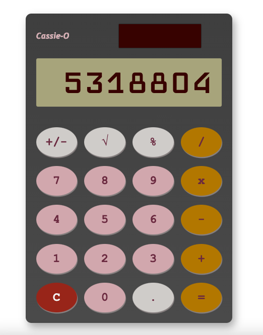

# Miniproject: static webpage calculator        

## [Deployment Link](https://hphilpotts.github.io/miniproject-static-calculator/)       

## Project Aim:       
**Build a working calculator, hosted on a static webpage, using HTML, CSS and vanilla JS.**     

I have chosen this miniproject primarily to refresh my familiarity with frontend web development, particularly CSS - having spent a lot of time recently on pure JavaScript or Python coding practice, I wanted to avoid skills atrophy in areas such as styling and project disciplines.       

By chosing a static site, I have removed a lot of complexity in terms of hosting my project (thanks to GitHub Pages) - this will allow me to use my (sadly limited) time more efficiently.      

Lastly, with the relatively simple choice of project, I am hoping to practice writing simple, clean code from beginning to end!     

## Project Progress:        
16/01/23:        
- Initial commit made: I had to look up quite a lot of CSS positioning in order to get going (!) but I am happy with how the outer calculator resizes on various screens.       
- Further structure added: logo, solar panel, margins - mostly achieved through flexbox. Re-visting CSS Grid tutorials next as this will be perfect for buttons!     
- Buttons added: used grid to quickly add 20 buttons arranged 4x5, then used table/table-cell to horizontally and vertically centre buttons. Additional styling added such as drab calculator colours for buttons etc.      
- Getting the screen to display: this now fills from the right like a calculator. I've set font size relative to VH with 13 seeming to be around the 'magic number' (_it was actually 12 in the end!_). Not sure if this is a great way of doing it but seemed to work nicely!     

- I've now shifted onto the JS. Event listeners added for all buttons, I have decided to use each button's `.innerHTML` property in order to handle clicks.     
- Display now updates when numeric buttons are pressed and wipes when equals is pressed.        
- All button presses now handled by `processButtonPress`. Cancel function added. Some tweaks required where global variables needed to be changed - otherwise I was seeing values persisting even after '=' or 'C' were pressed.      
- `processButtonPress` refactored into a switch statement :)        
- Basic calculator functionality now added. Using loads of `console.log`s in order to keep track of how global variables are being changed!     

17/01/23:       
- Now that I'm largely happy with basic functionality, I'm going to have a shot at deploying this. Took quite a few attempts to correctly place and then in turn locate the required .js file from my hphilpotts.github.io repo, as well as to choose the correct deployment.       
- After a bit of trial end error, and with the use of a separate `deployment` branch, I have been able to get this hosted as a static site via GH Pages. Happy days!        
- Only had a small amount of time to work on this today: the next jobs are to finish completing all functionalites, refactor code, and tweak formatting!        

19/01/23:       
- Formatting updates: display `font-size` now `12vh`. General formatting - updates to colours, shadows etc.     

20/01/23:       
- Changed display font, added update to `main.js` that prevents display from overlapping screen.        
- Last result from `evaluateInputs` now saves into variable, allows user to operate on a result: e.g. pressing `2`, `+`, `2`, `=` to get `4` before then pressing `*`, `2`, `=` to get `8` as with a typical simple calculator.     
- `NaN` coming through as `previousResult`, linked to issue where `null` remains in `previousInput`. I've not immediately been able to replicate this issue...! 
- Also seeing error in `evaluateInputs` where no operator is passed in if no operator has been pressed. Simple `if (output)` statement before executing string method prevents errors but causes immediate use of operator following `=` misbehave. Ultimately fixed by changing error message in `default` case to instead save `currentInput` to output.              
- If `=` is first button press, `NaN` comes through. Conditionals added either side of `switch` to handle different scenarios: behaviour now as normal.     
- Next steps: adding unary operators. These are now working, although I have started to see issues with floats - either in terms of very long strings displaying in the display, or where `evaluateInputs` produces integers rather than floats (due, of course, to the use of `parseInt()`). Addressed this second issue through the use of `parseFloat` and a `.slice` method on the display string.      
- Further issue seen where use of unary operators as first input after `=` throws error. Now fixed, but issue seen where sqrt is used with a decimal: shows as `1`. This new issue fixed along with a slew of others seen - used `.toFixed` in both `evaluateInputs` and `unaryOperatorPress`.      
- Last key functionality to add is `.` input. I've realised that I shoud take this out from `binaryOperatorPress` as this needs to be handled differently. A remarkably easy fix! This can in fact be handled through `numberPress`, easy peasy.        
- Another small issue seen where excess zeros are showing on the display for decimals.      

- I'm now going to refactor some of `main.js` before updating the deployed version.         

21/01/23:       
_Two issues, fed back when progress shared_:      
- Width issue fixed (required scrolling on taller, thinner screens). Initially using max of `100vw` but later changed to specific `px` value.       
- `previousInput` now persists on display after binary operator pressed (as with IRL calculator), changing once new number pressed.     

- Now working on adding a dark mode. Currently have a new CSS stylesheet, this can of course be trimmed down. Adding JavaScript to handle this functionality.       

22/01/23:       
- JS functionality added so that light / dark buttons now switch stylesheets. At the moment the entire stylesheet changes over, this could be sharpened up later on. Next step added!       
- Buttons look garbage, next step will be styling these!        

24/01/23:       
- Separated out light/dark mode CSS into separate files, with a third fixed 'style.css' handling styles not relating to view modes.     

25/01/23:       
- Restyled control buttons at top to improve appearance and mobile responsiveness.      

## Bugs to resolve/features to add:       
- Allow repeated presses of `=` to redo previous operation.     
- Allow consecutive operations before evaluation.       
- Account for repeated operator presses.        
- Dark mode, obviously!     
- Some of the bigger functions need splitting up (looking at you, `evaluateInputs`...)      
- Sounds?       